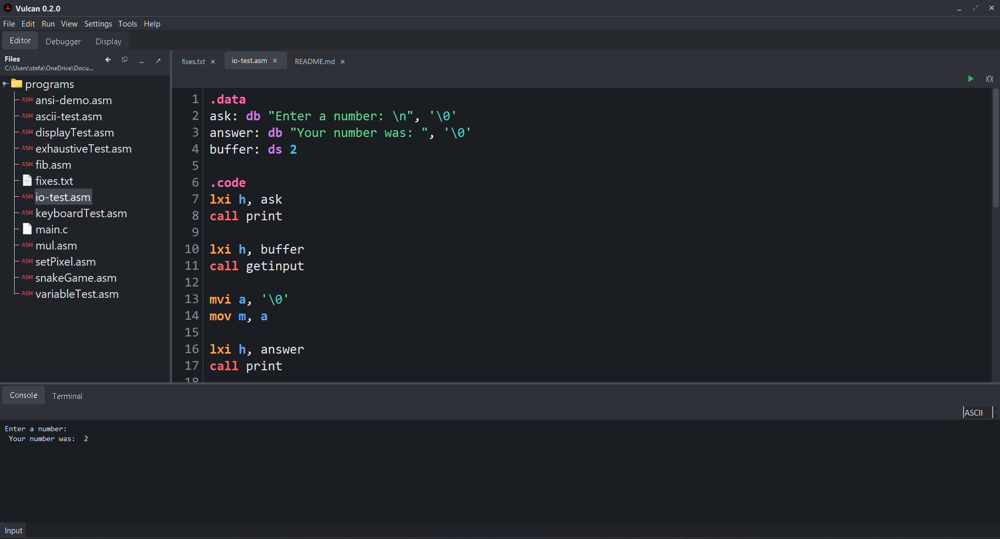
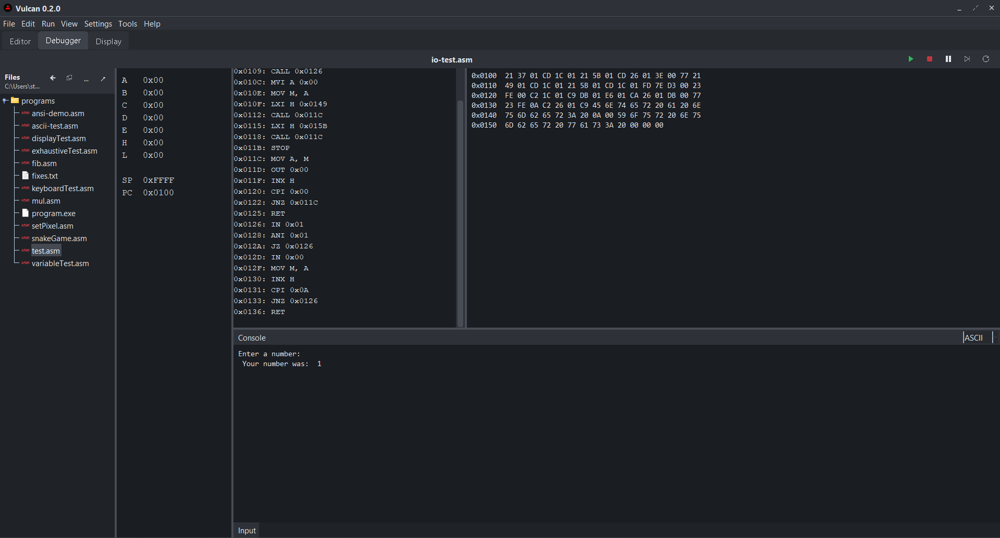
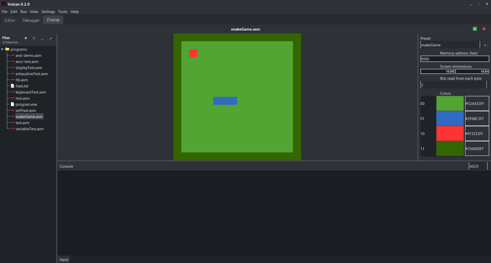

# Vulcan

**Vulcan** is an assembly development environment built from scratch around the **Intel 8080**.

It brings the process of writing, assembling, running, and debugging assembly into a single IDE. Programs written in Vulcan are assembled and executed on its custom Intel 8080 emulator, making it possible to work with assembly code without relying on external assemblers, emulators, or debugging tools.

The project started as an Intel 8080 emulator and assembler and has grown into a complete environment for experimenting with low-level programming and understanding how software interacts with a CPU at the instruction level.

## Features

- Assembly code editor
- Custom Intel 8080 assembler
- Intel 8080 CPU emulator
- Integrated debugger
- Disassembly and instruction inspection
- Breakpoints and execution controls
- Register and memory inspection
- Integrated program display
- Console and I/O support
- Project and file management
- Intel 8080 assembly programs can be written, assembled, executed, and debugged entirely inside Vulcan

## Editor

The Vulcan editor provides the main environment for writing and managing Intel 8080 assembly programs.



## Debugger

The integrated debugger provides tools for inspecting program execution, CPU state, memory, registers, and assembly instructions while a program is running.



## Display

Vulcan includes an integrated display for programs that produce graphical output through the emulator's video memory.



## How It Works

Vulcan takes assembly source code through the entire development process:

```text
Assembly Source
      |
      v
   Assembler
      |
      v
Machine Code
      |
      v
 Intel 8080
   Emulator
      |
      +------> Debugger
      |
      +------> Console / I/O
      |
      +------> Display
```

Rather than wrapping an existing emulator, the Intel 8080 CPU, assembler, memory system, and development tools are implemented as part of the project.

This makes Vulcan both an IDE and an exploration of how assemblers, processors, debuggers, memory, and development environments work underneath higher-level programming languages.

## Intel 8080

Programs executed by Vulcan target the **Intel 8080 instruction set**.

The emulator handles the CPU state and execution of assembled machine code, including registers, flags, memory, stack operations, control flow, arithmetic, logical operations, and I/O.

## Project Goals

Vulcan is primarily a learning project focused on building low-level development tools from scratch.

The project explores:

- CPU emulation
- Assembly language
- Machine code
- Assembler design
- Memory architecture
- Debugger design
- IDE development
- Graphics and video memory
- Low-level program execution

The long-term goal is to make Vulcan a practical environment where Intel 8080 assembly programs can be developed from start to finish without leaving the IDE.
---

*Built from scratch because apparently writing assembly wasn't low-level enough.*
